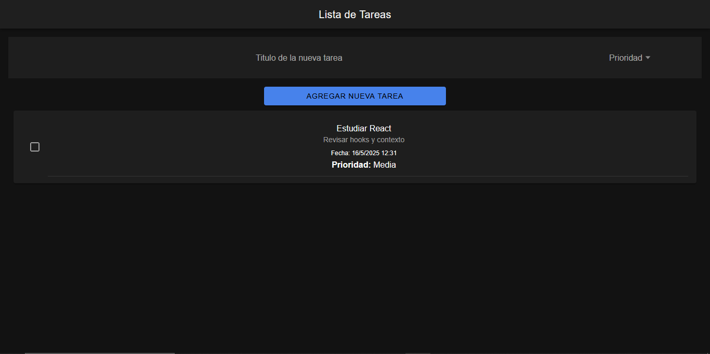

# 📝 ToDo-App

**ToDo-App** es una aplicación de lista de tareas desarrollada con tecnologías modernas como Ionic, Vite, TypeScript y Capacitor. Su objetivo es ofrecer una experiencia fluida y responsiva para la gestión de tareas diarias, tanto en dispositivos móviles como en navegadores web.

## 🚀 Características

- ✅ Crear, editar y eliminar tareas de forma sencilla.
- 📱 Interfaz adaptable a dispositivos móviles y escritorios.
- ⚡️ Desempeño optimizado con Vite.
- 🧪 Pruebas automatizadas con Cypress.
- 🔌 Compatible con despliegue móvil gracias a Capacitor.
- 🧩 Código modular y mantenible utilizando TypeScript.

## 🛠️ Tecnologías utilizadas

- [Ionic Framework](https://ionicframework.com/)
- [Vite](https://vitejs.dev/)
- [TypeScript](https://www.typescriptlang.org/)
- [Capacitor](https://capacitorjs.com/)
- [Cypress](https://www.cypress.io/)

## 📋 Sobre la aplicación

Se trata de una aplicación sencilla centrada en la gestión de tareas. La estructura actual del proyecto está diseñada para casos básicos de uso y no contempla, por el momento, una expansión a funcionalidades más complejas.

## 🔧 Estado actual del desarrollo

La aplicación se encuentra en estado **Beta**. Actualmente permite crear y editar tareas, pero aún no se ha implementado el manejo de tareas completadas ni la persistencia de datos.

## 📝 Próximas mejoras (To-Do)

- Implementar el marcado de tareas como completadas.
- Añadir lógica de persistencia, posiblemente utilizando almacenamiento local (localStorage).

---